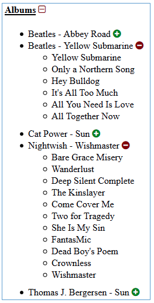

### React Front-End Interview Test

Please read this document for the full test description with screenshots.

#### Introduction

In this test your task is to display a list of music albums and songs, using React and Redux.

#### Specification

* Test data: in the data.json file we provide a static list of songs.
* Each song in the list has 3 attributes: band, album, song
* We expect to see a list of bands and albums with in an expandable/collapsible panel for the
  songs within the given album (see screenshots below):
    * The expand/collapse button on the individual albums should expand/collapse the list of songs
    * The expand/collapse button on the main Albums title should expand/collapse all the albums
* The main technologies you are expected to use
    * Choice of ajax: to get the list of songs from the server
    * Redux: to store the data
    * React: to display the list
* The supported browsers are: IE11, Firefox, Chrome, the solution expected to work on these.
  (note: only IE11, no backward compatibility with earlier IE is expected)

Please use the data.json file - static dataset for the test in json format.       |

#### Expected solution

1. The main purpose of this test is for you to show your ability to design and implement
   bespoke web sites using React/Redux.  
   We expect a working implementation, not just a screen design.
2. Please use ajax for getting the list of songs from the server, do not just import them.
3. Please use Redux to store the data.
4. Please use React for displaying the list.
5. You're free to use any related library you choose, this test not just about implementation skills, but  
   to see your design choices and your ability to create an integrated solution from multiple technologies.

#### Screenshots of example screens 

![Screen Shot 2019-04-23 at 16.22.12]

*(You’re free to use any iconset you like, these are here just an example for expand/collapse icons)*
